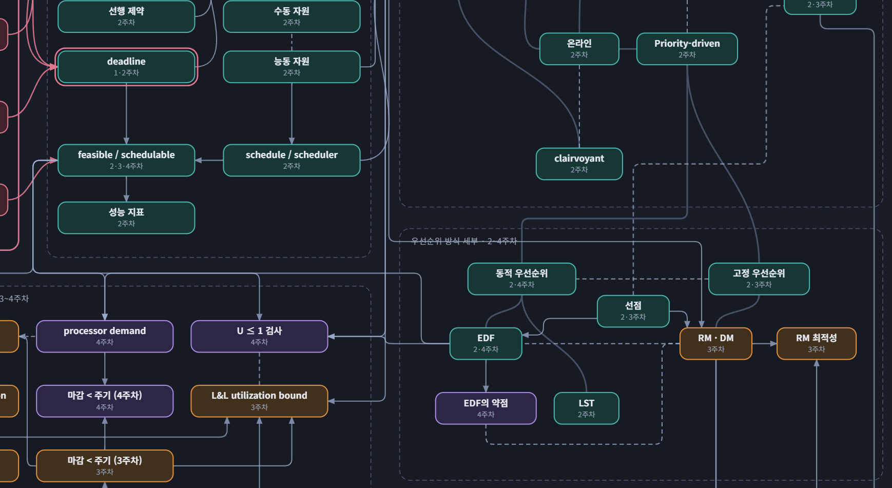
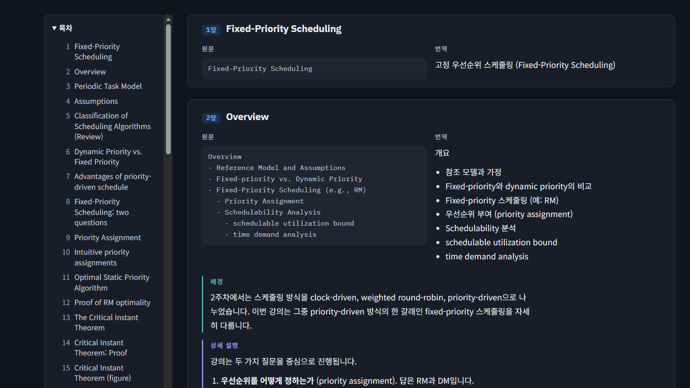

# lecture-sync

강의자료 폴더에 새 파일이 들어오면 다음 일을 하는 Claude Code 플러그인입니다.

1. 과목마다 고른 방식으로 정리 문서를 만듭니다.
   - **장별 보충본과 퀴즈**: 새 강의자료마다 아티팩트 두 개를 만듭니다.
     - 보충본: 슬라이드(장)마다 원문, 번역, 배경, 상세 설명, 예시와 풀이
     - 퀴즈: 잘 배웠는지 확인하는 문제와 해설. 답을 고르면 바로 채점합니다.
   - **예시 위주 예제집**: 과목마다 아티팩트 하나를 만들고, 새 자료가 올 때마다 예제를 더합니다. 배운 내용을 쓰는 실제 시스템이나 문제를 예제로 만들어 배경, 용어, 구조 그림, 상태도, 흐름, 전체 코드(또는 풀이), 설명을 담습니다.
2. 선택하면 강의 영상의 자막(스크립트)을 브라우저에서 읽어 정리 문서에 넣습니다.
3. 그 과목의 지식 그래프를 갱신해 아티팩트로 발행합니다.
4. 정리 문서와 그래프 링크, 바뀐 내용을 Gmail로 보냅니다.

그래프와 처리 기록은 과목 폴더마다 따로 저장됩니다. 과목끼리 섞이지 않습니다.

## 준비물

- Claude Code (Windows, WSL, Linux, macOS)
- Python 3.9 이상. 추가 패키지는 설치하지 않아도 됩니다. PDF를 읽는 pypdf는 플러그인 안에 들어 있습니다.
  - Windows는 https://www.python.org 에서 설치합니다. `python`, `py` 중 어느 명령이든 동작하면 됩니다.
- Gmail 앱 비밀번호. Google 계정에서 2단계 인증을 켠 뒤 "앱 비밀번호" 메뉴에서 만듭니다.

## 설치

셸에서 실행합니다.

```bash
claude plugin marketplace add kau-newbie/lecture-sync
claude plugin install lecture-sync@kau-newbie
```

## 비밀번호 등록

**WSL, Linux, macOS:** `~/.bashrc`(zsh는 `~/.zshrc`)에 한 줄을 추가하고 터미널을 다시 엽니다.

```bash
export GMAIL_APP_PASSWORD="앱 비밀번호 16자리"
```

**Windows:** PowerShell 또는 명령 프롬프트에서 실행하고, 터미널과 Claude Code를 다시 엽니다.

```powershell
setx GMAIL_APP_PASSWORD "앱 비밀번호 16자리"
```

비밀번호는 이 환경 변수로만 읽습니다. 파일에 저장하거나 화면에 출력하지 않습니다.

보내는 계정과 받는 주소가 다르면 `GMAIL_USER`에 보내는 계정을 추가로 등록합니다.

## 과목 폴더 설정

과목 폴더 맨 위에 `.lecture-sync.json` 파일을 만듭니다.

```json
{
  "course": "과목 이름",
  "notify_to": "받을 Gmail 주소",
  "extensions": [".pptx", ".ppt", ".pdf"]
}
```

| 항목 | 설명 |
|---|---|
| `course` | 과목 이름 |
| `notify_to` | 알림 메일을 받을 주소 |
| `extensions` | 강의자료로 볼 확장자. 생략하면 `.pptx`, `.ppt`, `.pdf` |
| `style` | (선택) 정리 방식. `"slides"`(장별 보충본과 퀴즈) 또는 `"examples"`(예시 위주 예제집). 생략하면 처음 실행할 때 묻고 저장합니다 |
| `transcript` | (선택) 강의 영상 스크립트 사용 여부. 예: `{"enabled": true, "browser": "chrome"}`. `browser`는 `"chrome"` 또는 `"edge"`. 쓰지 않으려면 `{"enabled": false}`. 생략하면 처음 실행할 때 묻고 저장합니다 |

`style`과 `transcript`는 직접 쓰지 않아도 됩니다. 처음 실행할 때 고른 값이 이 파일에 저장됩니다. 나중에 바꾸려면 값을 고치거나 Claude에게 바꿔 달라고 하면 됩니다. 방식을 바꾸면 새로 들어오는 자료부터 새 방식으로 정리합니다.

## 정리 방식 고르기

처음 실행할 때 두 방식 중 하나를 고릅니다. 스킬이 자료를 훑어보고 과목에 맞는 쪽에 "(추천)"을 붙입니다.

| | 장별 보충본과 퀴즈 (`slides`) | 예시 위주 예제집 (`examples`) |
|---|---|---|
| 정리 단위 | 강의자료 파일마다 보충본 1개, 퀴즈 1개 | 과목마다 예제집 1개. 새 자료가 오면 예제를 더함 |
| 내용 | 슬라이드 순서대로 원문, 번역, 배경, 상세 설명, 예시 | 배운 내용을 쓰는 실제 예제를 여러 개. 배경, 용어, 구조 그림, 상태도, 흐름, 전체 코드 또는 풀이, 설명 |
| 퀴즈 | 있음 | 없음 |
| 알맞은 과목 | 이론 중심 과목, 슬라이드를 순서대로 복습하고 싶을 때 | 코딩·설계 과목(HDL, 프로그래밍 등). 이론·계산 과목은 실제 상황 문제와 단계별 풀이로 만듦 |
| 범위 | 파일 하나 | 지금까지 처리한 주차 전체. 뒤 주차 개념을 쓰면 "미리보기"로 표시 |

어느 쪽이 맞는지 헷갈리면 추천을 따르면 됩니다. 예제집은 강의자료의 모든 장을 다루지 않으므로, 슬라이드 하나하나를 확인하고 싶으면 장별 보충본을 고릅니다.

## 강의 영상 스크립트

처음 실행할 때 "사용하지 않음", "Chrome에서 가져오기", "Edge에서 가져오기" 중 하나를 고릅니다. 가져오기를 고르면 다음과 같이 동작합니다.

- Claude in Chrome 확장 프로그램으로, 로그인된 브라우저에서 강의 영상 페이지를 엽니다. 확장 프로그램이 설치되어 Claude Code와 연결되어 있어야 합니다. Edge를 고른 경우 Edge에 이 확장 프로그램을 설치해 연결해야 하며, 연결되지 않으면 Chrome으로 진행할지 묻습니다.
- 강의 사이트 로그인은 사용자가 브라우저에서 직접 합니다. 강의 사이트나 영상 페이지 주소는 실행 중에 묻습니다.
- 사이트가 화면에 제공하는 자막이나 스크립트 텍스트만 읽습니다. 동영상을 내려받거나 음성을 직접 텍스트로 바꾸지 않습니다. 자막이 없는 영상은 건너뜁니다.
- 읽은 텍스트는 과목 폴더의 `.lecture-sync/transcripts/`에만 저장합니다. 보충본에는 장마다 "강의 설명" 칸으로, 예제집에는 예제의 "강의 설명" 칸으로 들어갑니다.
- 스크립트는 음성 인식 결과일 수 있어 용어가 틀릴 수 있습니다. 슬라이드와 맞춰 확인되는 내용만 쓰고 출처를 표시합니다.
- 강의 영상과 자막의 이용 조건은 학교나 강의 사이트의 규정을 따르세요. 정리 문서를 다른 사람과 공유할 때도 마찬가지입니다.

## 권장 폴더 구조

과목마다 폴더 하나를 두고, 그 안에 주차 폴더를 둡니다. 아래는 실제 과목 폴더를 바탕으로 한 예시입니다.

```
2026-2학기/                                   학기 폴더. 설정 파일을 두지 않습니다.
├── 모바일센서nw/                              과목 폴더
│   ├── .lecture-sync.json                     과목 설정 (직접 작성)
│   ├── .lecture-sync/                         플러그인이 만들고 관리하는 폴더
│   │   ├── manifest.json                      처리한 강의자료 기록
│   │   ├── graph.json                         이 과목의 지식 그래프 데이터와 아티팩트 링크
│   │   ├── graph.html                         graph.json으로 만든 그래프 페이지
│   │   ├── notes/w3-rtsensor3/                (slides 방식) 강의자료마다 보충본과 퀴즈 데이터, 아티팩트 링크
│   │   ├── examples/                          (examples 방식) 예제집 데이터: meta.json, ex-*.json, fig/*.svg, code/*
│   │   └── transcripts/                       (선택) 강의 영상에서 읽은 스크립트
│   ├── CLAUDE.md                              (선택) 과목 안내. 주차별 흐름 목록이 있으면 스킬이 새 주차를 추가합니다.
│   ├── 1주차/
│   │   └── RtLec1_2026.pptx
│   ├── 2주차/
│   │   ├── RTSensor1_2.pptx
│   │   └── Rtsensor2ext.pptx
│   ├── 3주차/
│   │   └── Rtsensor3_RM.pptx                  원본 강의자료
│   ├── 4주차/
│   │   └── Rtsensor4.pptx
│   └── 5주차/                                 아직 자료가 없는 주차는 빈 폴더로 둡니다.
└── 다른과목/                                  과목마다 그래프와 기록이 따로 생깁니다.
    ├── .lecture-sync.json
    ├── .lecture-sync/
    └── 1주차/
```

지켜야 할 점은 다음과 같습니다.

- **설정 파일은 과목 폴더에만 둡니다.** 학기 폴더에 두면 그 아래 모든 과목의 자료가 한 과목으로 처리되어 그래프가 섞입니다.
- **Claude Code는 과목 폴더나 그 아래 주차 폴더에서 엽니다.** 설정 파일은 현재 폴더에서 위쪽 방향으로만 찾습니다. 학기 폴더에서 열면 아무 동작도 하지 않습니다.
- **주차 폴더에는 원본 강의자료만 두면 됩니다.** 보충본과 퀴즈는 아티팩트로 만들고, 데이터는 `.lecture-sync/notes/`에 저장합니다.
- **강의자료가 아닌 파일에 주의합니다.** 과제 PDF처럼 강의자료가 아닌 파일도 `extensions`에 맞으면 새 자료로 처리됩니다. 과목 폴더에 이런 파일이 있으면 `extensions`를 `[".pptx"]`처럼 좁히거나, 과목 폴더 밖에 둡니다.
- **파일 이름은 바꾸지 않아도 됩니다.** `파일 (1) (2).pptx` 같은 다운로드 중복 표시가 있어도 됩니다. 내용이 같은 복사본은 자동으로 건너뜁니다.
- **`.lecture-sync/` 폴더는 지우지 않습니다.** 지우면 처리 기록과 그래프, 보충본, 퀴즈 링크가 사라져, 다음 실행 때 처음 설정한 과목으로 처리됩니다.
- **`~$`로 시작하는 파일은 무시됩니다.** Word나 PowerPoint가 파일을 열어 둘 때 만드는 임시 파일입니다.

## 사용 방법

1. 과목 폴더에서 Claude Code를 엽니다.
2. 처음 열면 세 가지를 묻습니다.
   - 기존 자료를 모두 정리할지, 처리한 것으로 기록만 할지
   - 정리 방식: 장별 보충본과 퀴즈, 또는 예시 위주 예제집
   - 강의 영상 스크립트: 사용하지 않음, Chrome, Edge
3. 이후에는 새 파일이 있을 때 첫 메시지를 보내면 정리가 시작됩니다.
4. 직접 실행하려면 `/lecture-sync:sync`를 입력합니다.

## 알아 둘 점

- 새 파일은 Claude Code 세션을 시작할 때 확인합니다. 세션 도중에 넣은 파일은 다음 세션에 확인하거나 `/lecture-sync:sync`로 처리합니다.
- 내용이 같은 파일은 새 자료로 보지 않습니다. 예를 들어 `파일 (1).pptx` 같은 다운로드 복사본은 건너뜁니다.
- 구형 `.ppt`는 읽을 수 없습니다. PowerPoint에서 `.pptx`로 저장하면 새 자료로 처리됩니다.
- 슬라이드의 그림과 수식 개체는 글자로 추출되지 않습니다. 보충본과 그래프에 "확인하지 못한 부분"으로 표시합니다.
- 예제집의 코드는 컴파일러나 시뮬레이터가 있는 환경이면 실행해 확인하고, 없으면 "실행해 보지 않았다"고 페이지에 표시합니다.
- 퀴즈의 풀이 기록은 보는 사람의 브라우저에만 저장됩니다. 다른 기기에서는 처음부터 풀게 됩니다.
- 보충본은 번역과 설명을 모두 담기 때문에 강의자료 하나를 처리하는 데 시간이 걸립니다. 슬라이드 50장 정도면 수십 분이 걸릴 수 있습니다.
- 아티팩트 기능이 없는 환경에서는 그래프, 보충본, 퀴즈를 `.lecture-sync/` 안의 HTML 파일로 저장합니다.
- `.lecture-sync.json`이 없는 폴더에서는 아무 동작도 하지 않습니다.

## 파일 구성

```
.claude-plugin/marketplace.json     마켓플레이스 목록
plugins/lecture-sync/
  .claude-plugin/plugin.json        플러그인 정보
  hooks/hooks.json                  세션 시작 시 변경 확인
  skills/sync/SKILL.md              정리 절차
  scripts/detect.py                 변경 감지와 처리 기록
  scripts/py.sh                     운영체제에 맞는 Python을 찾아 스크립트 실행
  scripts/extract_slides.py         슬라이드별 글자 추출
  scripts/_vendor/                  PDF 읽기용 pypdf와 라이선스 (수정하지 않음)
  scripts/build_graph.py            그래프 HTML 생성과 겹침 검사
  scripts/graph_template.html       그래프 페이지 틀
  scripts/build_notes.py            보충본과 퀴즈 HTML 생성과 검사
  scripts/notes_template.html       보충본 페이지 틀
  scripts/quiz_template.html        퀴즈 페이지 틀
  scripts/build_examples.py         예제집 HTML 생성과 검사 (그림, 코드 파일 포함)
  scripts/examples_template.html    예제집 페이지 틀
  scripts/notify.py                 Gmail 발송
  config.example.json               과목 설정 예시
```

## 예시

먼저, 아래와 같은 강의자료 지식 그래프를 생성합니다.



- 마우스를 올려두면, 이웃 노드들만 밝게 표시됩니다.


 
- 장별 보충본 방식에서는 다음과 같이 매 강의자료마다 정리됩니다. 강의자료(pdf, pptx)의 페이지별로 아래와 같이 구성됩니다.
	- 번역
	- 배경설명
	- 상세설명
 	- (필요할경우) 예시와 풀이

써보니까 강의자료가 ppt 56장일 때, 하나의 html 파일 만드는ㄷ, 클로드 pro 기준 4-5% 정도 쓰는 것 같았습니다.

## 라이선스

MIT 라이선스입니다. 자세한 내용은 `LICENSE` 파일에 있습니다.
